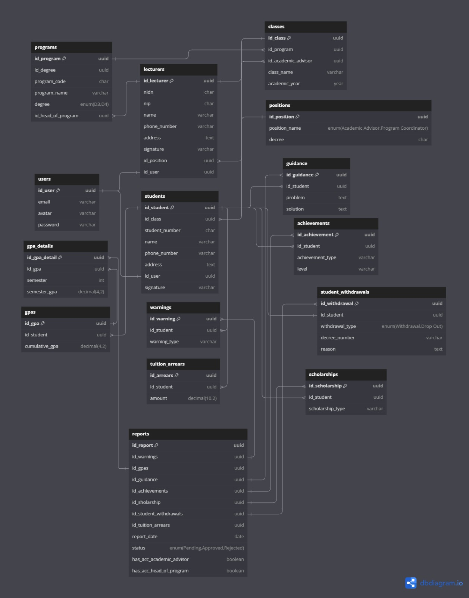
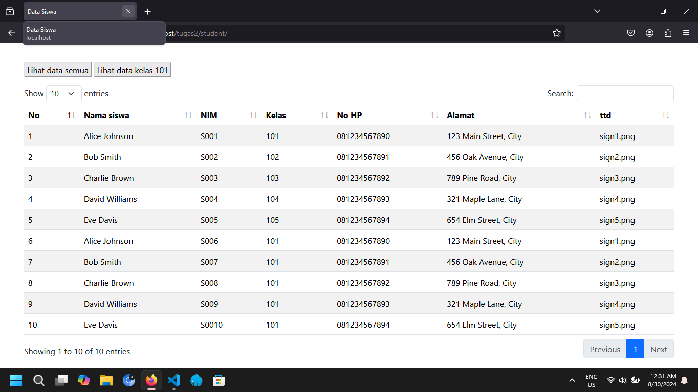
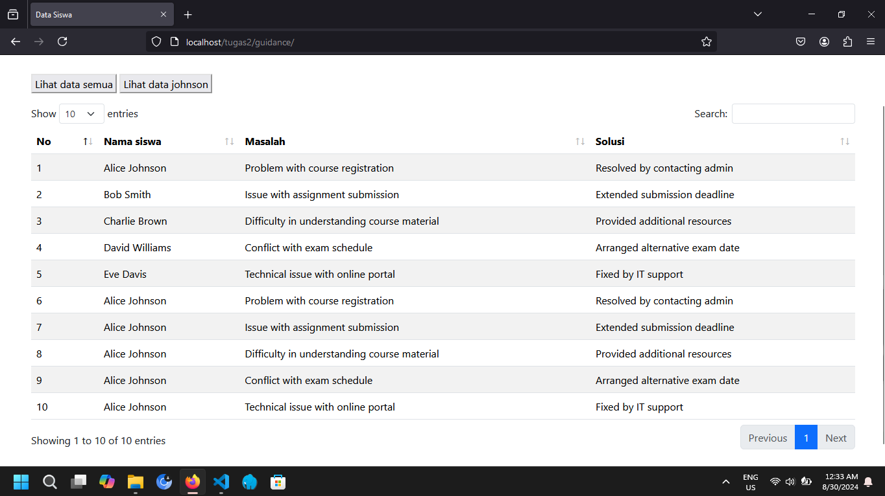
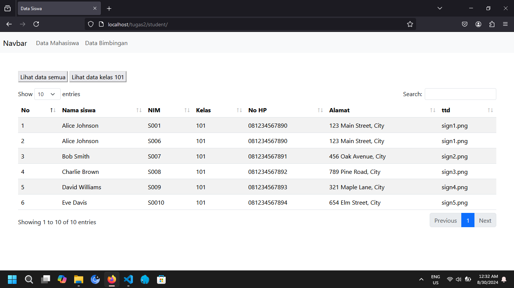
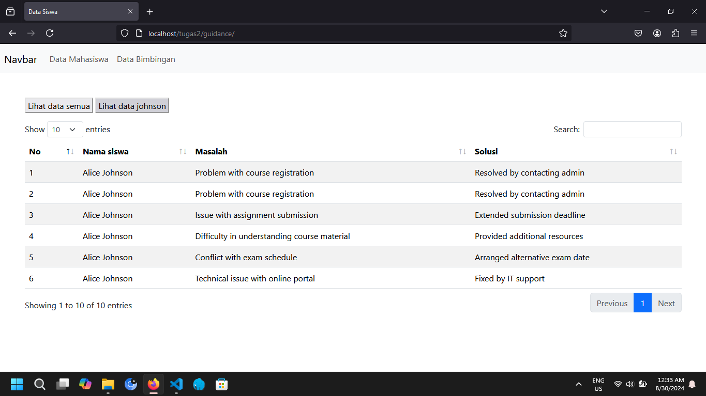

# Tugas 2 Praktikum Pemrograman Web
## Penjelasan
**Tugas ini guna untuk memenuhi tugas 2 pemrograman web 2**

## Task
1. **membuat view berbasis OOP PHP dengan menerima data dari mySQL database (tabel reports, gpas dan gpa_details)**
2. **menggunakan __construct sebagai link untuk menghubungan ke database**
    ```php
      <?php

      class Database {
         private $host, $username, $password, $db;
         protected $conn;
         
         public function __construct(){
            $this->host = 'localhost';
            $this->username = 'root';
            $this->password = '';
            $this->db = 'tugas2';
            
            $this->conn = new mysqli($this->host, $this->username, $this->password, $this->db) ;
            
            if ($this->conn->connect_error) {
               die("Koneksi gagal: " . $this->conn->connect_error);
            }
         }
         
         public function showData(){
         }
      }
 
    ```
3. **menerapkan encapsulation berdasarkan studi kasus**
    ```php
       <?php
         private $host, $username, $password, $db;
         protected $conn;
    ```
4. **menggunakan kelas turunan dengan konsep inheritance**
    ```php
    class Database{
      // code ..
    }

    class Student extends Database{
      // code ..
    }

    class Kelas101 extends Student{
       // code ..
    }
    ```
5. **menerapkan polymorphiism**
    ```php
    class Student extends Database{
        public function showData(){
          // code ..
        }
    }

    class Kelas101 extends Student{
        public function tampil_data(){
          // code ..
        }
    }
    ```
## ERD (Entity Relationship Diagram)

## Tampilan Program
+ menampilkan seluruh isi tabel student 

+ menampilkan seluruh isi tabel guidance 

+  menampilkan isi tabel student yang kelasnya = 101 

+ menampilkan isi tabel guidance yang namanya = alice johnson 
